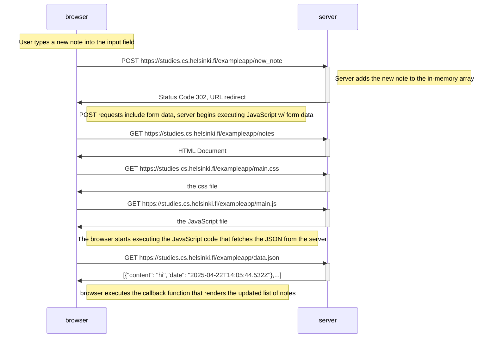

```mermaid
sequenceDiagram
    participant browser
    participant server

    Note over browser: User types a new note into the input field
    browser ->> server: POST https://studies.cs.helsinki.fi/exampleapp/new_note
    activate server
    Note right of server: Server adds the new note to the in-memory array
    server ->> browser: Status Code 302, URL redirect
    deactivate server

    Note right of browser: POST requests include form data, server begins executing JavaScript w/ form data

    browser ->> server: GET https://studies.cs.helsinki.fi/exampleapp/notes
    activate server
    server ->> browser: HTML Document
    deactivate server

    browser ->> server: GET https://studies.cs.helsinki.fi/exampleapp/main.css
    activate server
    server ->> browser: the css file
    deactivate server

    browser ->> server: GET https://studies.cs.helsinki.fi/exampleapp/main.js
    activate server
    server ->> browser: the JavaScript file
    deactivate server

    Note right of browser: The browser starts executing the JavaScript code that fetches the JSON from the server

    browser ->> server: GET https://studies.cs.helsinki.fi/exampleapp/data.json
    activate server
    server ->> browser: [{"content": "hi","date": "2025-04-22T14:05:44.532Z"},...]
    deactivate server

    Note right of browser: browser executes the callback function that renders the updated list of notes

```