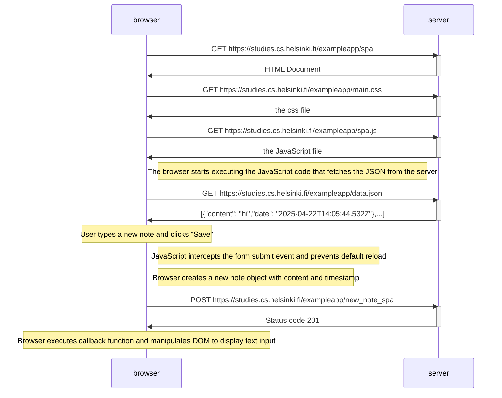

```mermaid
sequenceDiagram
    participant browser
    participant server

    browser ->> server: GET https://studies.cs.helsinki.fi/exampleapp/spa
    activate server
    server ->> browser: HTML Document
    deactivate server

    browser ->> server: GET https://studies.cs.helsinki.fi/exampleapp/main.css
    activate server
    server ->> browser: the css file
    deactivate server

    browser ->> server: GET https://studies.cs.helsinki.fi/exampleapp/spa.js
    activate server
    server ->> browser: the JavaScript file
    deactivate server

    Note right of browser: The browser starts executing the JavaScript code that fetches the JSON from the server

    browser ->> server: GET https://studies.cs.helsinki.fi/exampleapp/data.json
    activate server
    server ->> browser: [{"content": "hi","date": "2025-04-22T14:05:44.532Z"},...]
    deactivate server

    Note over browser: User types a new note and clicks "Save"

    Note right of browser: JavaScript intercepts the form submit event and prevents default reload

    Note right of browser: Browser creates a new note object with content and timestamp

    browser ->> server: POST https://studies.cs.helsinki.fi/exampleapp/new_note_spa
    activate server
    server ->> browser: Status code 201
    deactivate server

    Note over browser: Browser executes callback function and manipulates DOM to display text input

```